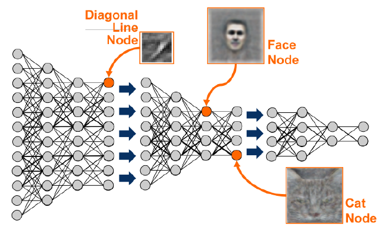
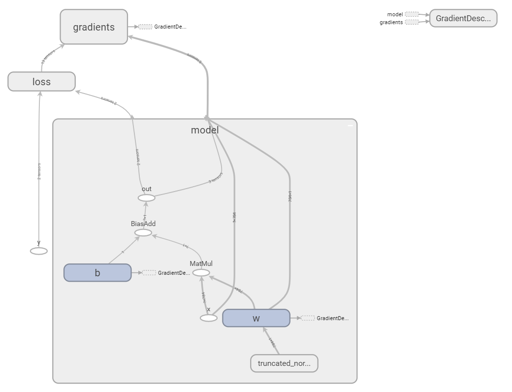
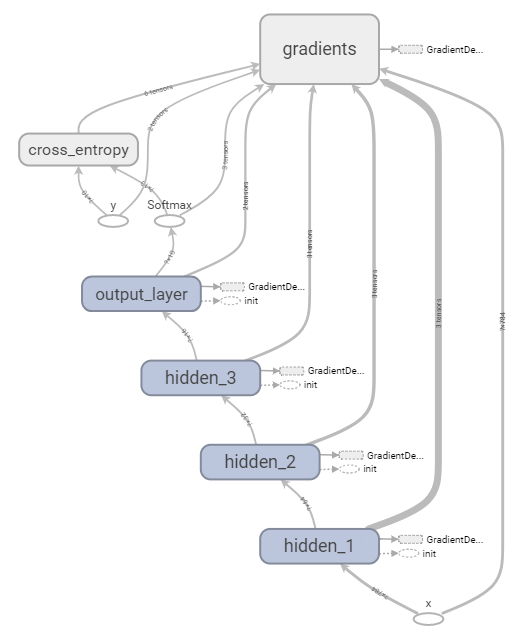
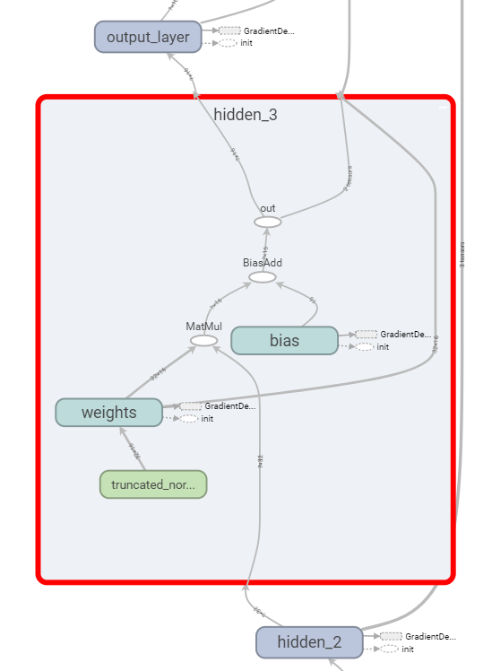

class: middle, center

# TensorFlow and Keras (deep learning by Google) 

[Romain Mormont](http://www.montefiore.ulg.ac.be/~rmormont/)


---
name: with_footer

#  "<i>I, Me, Mine</i>" 

- **Doctorant en machine learning (ML)** à Montefiore sous la supervision de Pierre Geurts et Raphaël Marée  
- **Recherche**: machine learning appliqué au traitement de (très) grandes images médicales

.center[

]

---

# Machine learning ?

Le **machine learning** (supervisé) est un ensemble de méthodes permettant à un système informatique de construire/d'apprendre un modèle entrée(s)-sortie(s) sur base d'un ensemble de données. 

Un **modèle** peut être vu comme une relation entre une ensemble d'entrées (i.e. les variables) et une sortie. Il possède des **paramètres** que l'on peut modifier afin l'adapter à un problème cible. Par exemple:

.grid[
    
    
]

---

# Deep learning ?

Le **deep learning** est un ensemble de méthodes de machine learning basées sur l'apprentissage de **hierarchies de descripteurs** (<i>hierarchical features</i>). 

Un **descripteur** (<i>feature</i>) est une information extraite d'une entité dans le but de la décrire.

En <i>vision par ordinateur</i>: *pixel > bord > texton > motif > morceau > objet*

.center[]

???

Image source: [https://i.stack.imgur.com/Hl2H6.png](https://i.stack.imgur.com/Hl2H6.png)

---
# Deep learning ?

Autres exemples:

- <i>reconnaissance vocale</i>: échantillon > bande spectrale > formant > motif > phonème > mot
- <i>traitement du langage naturel</i>: caractère > mot > groupe nominal/verbal > clause > phrase > histoire
<h2 style="text-align: center; padding-top: 20px; font-size: 115%;">
    Les méthodes de <em>deep learning</em> exploitent ces hierarchies à l'aide de réseaux neuronaux en couche pour obtenir des modèles performants.
</h2>

.center[]

???

Image source: https://cdn-images-1.medium.com/max/1600/0*1qOdceFenYSdGEYc.

---
# Deep **learning** ?

Travailler avec un modèle sur une tâche cible implique en général deux grandes étapes:

- **entraînement** (<i>training, learning</i>): on optimise les paramètres du modèle afin d'améliorer ses performances. Procédure classique: 
    1. on fournit au modèle un sous-ensemble aléatoire des données d'entraînement (<i>batch</i>) pour lesquels on connait l'objectif et il retourne un ensemble de prédictions $\hat{y}$
    2. on indique au modèle à quel point ses prédictions $\hat{y}$ sont erronnées à l'aide d'une **fonction de perte/d'erreur** (<i>loss function</i>)
    3. sur base de l'erreur, les paramètres du modèle sont ajustés pour améliorer ses performances (via **backpropagation**)
    4. on répète les étapes 1 à 3 jusqu'à ce que le modèle soit suffisamment performant
- **inférence** (<i>prediction, inference</i>): utilisation du modèle afin de produire une prédiction sur des nouvelles données

---
# Deep learning frameworks 

Beaucoup de frameworks disponibles: 

- **TensorFlow** (by Google)
- **Keras** (intégré dans TensorFlow depuis 01/2017)
- **Torch/PyTorch** (by Facebook)
- **Caffe2** (by Facebook)
- **CNTK** (by Microsoft)
- **MXNet** (sponsored by the Apache Incubator)
- **DL4j** (by Skymind)
- **Theano** (fin du support annoncée le 28/09/2017)
- ...

???
Ne pas s'enfermer dans un framework en particulier ! 

---
# TensorFlow

D'après Google: "**<i>An open-source software library for Machine Intelligence</i>** "

Quelques dates:

- 09/11/15: [open-source release](https://research.googleblog.com/2015/11/tensorflow-googles-latest-machine_9.html)
- 03/01/17: [choix de Keras](https://research.googleblog.com/2015/11/tensorflow-googles-latest-machine_9.html) comme interface haut-niveau
- 15/02/17: [version 1.0.0](https://github.com/tensorflow/tensorflow/releases/tag/v1.0.0)
- 06/11/17: [dernière release stable (1.4.0)](https://github.com/tensorflow/tensorflow/releases/tag/v1.4.0)

Quelques chiffres (sur GitHub):

- 1134 contributeurs
- 24117 commits, ~250 par semaine
- 76199 followers
- 1162 issues ouvertes (7689 fermées)

???
Librairie de calcul numérique avec des outils pour le deep learning.

---
# TensorFlow 

<span style="font-size: 90%"> 
- **Librairie de mathématique symbolique**
- **Interface de programmation en Python** mais coeur en C++
- **Graphe de calcul statique**: les noeuds sont les *opérations* et les arêtes sont les *tenseurs*
    - Le graphe doit être compilé avant d'être utilisé
    - Optimisations possibles à la compilation
    - <span></span>&nbsp; Ne permet pas d'implémenter des comportements dynamiques
- **Support deep learning**: beaucoup de composants de base disponibles
- **Programmation déclarative**: le graphe de calcul est construit de manière déclarative
    - Un pas vers l'impératif avec *Eager* (pre-alpha)
- **Support (multi) GPU**
- **TensorBoard**: outil de visualisation, monitoring temps réel via une interface web
</span>

???
- **`Dataset` API**: construction de pipelines complexes d'accès aux données
- **Debugger dédié `tfdbg`** 

Pourquoi "TensorFlow" ?

Un **tenseur** (<i>tensor</i>) est un objet mathématique. Un scalaire est un tenseur d'ordre 0, un vecteur est un tenseur d'ordre 1, une matrice est un tensor d'ordre 2,... 

- Scalaire: 
```
5.23
``` 
- Vecteur : 
```
[5.3 26.7 33.23]
```
- Matrice : 
```
| 5.3  26.7  33.23 |
| 5.3  3.25  22.53 |
| 8.03 27.1  33.00 |
```

---
# TensorFlow
## Graphe de calcul: définition et exécution

Implémentons l'opération suivante en TensorFlow: 

$$ y = \sqrt{a + \sin(b)} $$


```python
from math import pi
import tensorflow as tf

if __name__ == "__main__":
    # graph definition
    a = tf.placeholder(tf.float32, shape=(), name="a")
    b = tf.placeholder(tf.float32, shape=(), name="b")
    radicand = a + tf.sin(b)
    y = tf.sqrt(radicand)

    # execution
    with tf.Session() as sess:
        feed = {a: 3, b: pi / 2.0}
        res, = sess.run([y], feed_dict=feed)

        print("y: {}".format(res))
```

???
- s'exécute sur GPU par défaut si un est disponible et si tensorflow est installé avec support GPU

- compilation du graphe lors de l'instanciation de la session

---
# TensorFlow
## Graphe de calcul: visualisation avec TensorBoard


---
# Keras

Keras, d'après son créateur:

> <i>**Keras** is a high-level neural networks API, written in Python and capable of running on top of TensorFlow, CNTK, or Theano.</i>

Philosophie:

- **User-friendliness**: dévelopé de manière à réduire la charge cognitive du développeur (i.e. API cohérente et simple, feedback d'erreur clair et exploitable, use cases communs implémentables en un nombre réduit d'étapes...)
- **Modularité**: la librairie est structurée comme un ensemble de modules indépendants qui peuvent être combinés pour créer des modèles
- **Extensibilité**: de nouveaux modules peuvent être créés et intégrés de manière simple

---
# Deep learning with TensorFlow
 
Concentrons-nous sur un problème en particulier: la reconnaissance d'image et plus particulièrement la **reconnaissance de chiffres écrits à la main**.

- Chaque image contient un chiffre de 0 à 9
- Image en noir et blanc, taille 28x28 pixels
- **Objectif**: étant donnée l'image, prédire le chiffre qu'elle contient  

.my-gallery[
	
	
]

???
Image source:
- https://knowm.org/wp-content/uploads/Screen-Shot-2015-08-14-at-2.44.57-PM.png
- https://ujwlkarn.files.wordpress.com/2016/08/8-gif.gif?w=192&h=192

---
# (Deep) learning with TensorFlow
## Perceptron binaire > modèle (i)

Commençons par essayer de distinguer deux chiffres $c\_0$ et $c\_1$ avec un modèle simple (et *superficiel*): le **perceptron binaire**.

$$ \hat{y} = \sigma\left( \sum\_{i = 1}^{N} w\_{i} x\_{i} + b\right) $$

.center[]

.center[On optimise **les paramètres** du perceptron (i.e. les poids $w_i$ et le biais $b$) afin que le modèle puisse distinguer les deux chiffres.]

???

- on transforme/aplati la matrice/image d'entrée un en vecteur (784 éléments)

---
# (Deep) learning with TensorFlow
## Perceptron binaire > modèle (ii)

- le **perceptron est aussi appelé neurone** car inspiré du fonctionnement de la cellule cérébrale
- l'opérateur $\sigma(\cdot)$ est la fonction sigmoïde: $\sigma(x) = \frac{1}{1 + e^{-x}}$

.center[]

- $\sigma(\cdot)$ est la **fonction d'activation** du neurone
- $\hat{y}$ est la probabilité que le chiffre soit $c\_1$ 
- pour déterminer le chiffre, on choisit $c\_0$ si $\hat{y} \leq 0.5$, $c\_1$ sinon

???


---
# (Deep) learning with TensorFlow
## Perceptron binaire > modèle (iii)

Pour exploiter les capacités de TensorFlow, on va transformer le perceptron en un **problème vectoriel**. 

$$ \hat{y} = \sigma\left(\mathbf{x}^T\mathbf{w} + b\right) $$

- **entrée**: un vecteur $\mathbf{x}$ de 784 éléments
- **poids**: un vecteur $\mathbf{w}$ de 784 éléments
- **biais**: un scalaire $b$

En pratique, on veut que le modèle puisse **traiter plusieurs images à la fois** !

Dans le code, on va donc plutôt utiliser une matrice d'entrée $\mathbf{X}$ de taille ($B \times 784$) où $B$ est le nombre d'images.

???
Pourquoi ? pas possible d'implémenter efficacement autrement, plus élégant, GPU

---
# (Deep) learning with TensorFlow
## Perceptron binaire > modèle (iv)

Entrées et variables: 

- entrée du modèle $\mathbf{X}$ $\rightarrow$ `tf.placeholder`
```python
x = tf.placeholder(shape=[None, 784], dtype=tf.float32, name="x")
```
   
- variables du modèle $\mathbf{w}$ et $b$ $\rightarrow$ `tf.Variable` 
```python
w = tf.Variable(  # weights
        initial_value=tf.truncated_normal(shape=[784, 1]),
        trainable=True, name="w"
)
```
```python
b = tf.Variable(  # bias
        initial_value=tf.zeros(shape=[1], dtype=tf.float32),
        trainable=True, name="b"
)
```

???
- None indique une taille indéterminée
- les variables peuvent être <i>entraînables</i> ou non
- on doit définir une stratégie d'initialisation 

---
# (Deep) learning with TensorFlow
## Perceptron binaire > modèle (v)

Opérations:

- produit matriciel $\rightarrow$ `tf.matmul`
```python
mult = tf.matmul(x, w)
```
- ajouter le biais $\rightarrow$ `tf.nn.bias_add`
```python
with_bias = tf.nn.bias_add(mult, b)
```
- sigmoïde $\rightarrow$ `tf.nn.sigmoid`
```python
    out = tf.nn.sigmoid(with_bias, name="out")
```

Notons l'utilisation de `tf.nn`, le **module <i>neural networks</i> de TensorFlow**.

---
# (Deep) learning with TensorFlow
## Perceptron binaire > entraînement > loss

Pour optimiser le modèle, il faut pouvoir quantifier son erreur avec la fonction de perte.

**Entropie croisée binaire** (<i>binary cross-entropy</i>): 

$$\mathcal{L}(y, \hat{y}) = - y \log \hat{y} - (1 - y) \log (1 - \hat{y}) $$

- **$y$ identifie le véritable chiffre** pour une image d'entrée. Il vaut 0 si le chiffre est $c\_0$, 1 sinon.
```python
y = tf.placeholder(shape=[None, 1], dtype=tf.float32, name="y")
```

- implémentation de la fonction de perte
```python
ce = - y * tf.log(out) - (1 - y) * tf.log(1 - out)
loss = tf.reduce_mean(ce, name="loss")
```

---
# (Deep) learning with TensorFlow
## Perceptron binaire > entraînement > optimisation

Il faut maintenant définir la **stratégie d'optimisation** que TensorFlow va utiliser pour mettre à jour le modèle.

Nous allons utiliser une **descente de gradient**:

```python
optimizer = tf.train.GradientDescentOptimizer(learning_rate=1e-3)
minimize = optimizer.minimize(loss)
```

Beaucoup d'[autres méthodes](https://www.tensorflow.org/api_docs/python/tf/train) sont implémentées dans TensorFlow: 

- `AdamOptimizer`
- `MomentumOptimizer`
- `RMSPropOptimizer`
- ...

---
# (Deep) learning with TensorFlow
## Perceptron binaire

.center[]

???

Le graphe est prêt !

---
# (Deep) learning with TensorFlow
## Perceptron binaire > entraînement > code

```python
initializer = tf.global_variables_initializer()

with tf.Session() as sess:
    sess.run([initializer])

    for i in range(1000):
        feed = {
            x: # random batch of images...
            y_true: # and their classes
        }
        _loss, _ = sess.run([loss, minimize], feed_dict=feed)
        print("At iter {}, loss is {}".format(i, _loss))
```
<span style="font-size: 65%">
- On exécute l'opération `minimize` un certain nombre d'itérations
- À chaque itération, on fournit un batch aléatoire
- Et .. c'est tout !

.center[**TensorFlow fait beaucoup de choses pour nous dans l'ombre !**]
</span>

???
- forward pass
- backpropagation
- mise à jour des poids

---
# Deep learning with TensorFlow
## Vers un modèle plus réaliste... 

Le *perceptron binaire* n'est jamais utilisé seul dans les applications réelles car **ce modèle est trop simple**.

- les *problèmes réels* sont *trop complexes* pour le perceptron
- il est limité à des *problèmes binaires* 
- il est *superficiel* et ne permet pas d'exploiter la *nature hierarchique* de certains problèmes

Nous allons étudier un *autre modèle* qui:

- combine des perceptrons
- tente de résoudre les problèmes évoqués ci-dessus

<h2 style="text-align: center; padding-top: 20px; font-size: 115%;">
   	Ce modèle est le <em>perceptron multicouche</em> <br> 
   	<span style="font-size: 80%">(<i>multi-layer perceptron</i>)</span>
</h2>

---
# Deep learning with TensorFlow
## Perceptron multicouche
Ce modèle est un ensemble de perceptrons arrangés **en couches**.

.center[]

<span style="font-size: 0.8em;">
- les couches internes s'appellent **couches cachées** (<i>hidden layer</i>)
- chaque neurone est connecté à tous les neurones de la couche précédente
- il y a *autant de neurones que de classes* dans la dernière couche 
</span>

---
# Deep learning with TensorFlow
## Perceptron multicouche > définition (i)

- $L$ est le **nombre de couches**. La couche 0 est le vecteur d'entrée $\mathbf{x}$ 
- $n_l$ est le **nombre de neurones** à la couche $l \in [0, L]$
- $\mathbf{W}\_l$ est la **matrice des poids** de la couche $l \in [1, L]$, (dim. $n\_{l-1} \times n\_l$) 
- $\mathbf{b}\_l$ est le **vecteur de biais** pour la couche $l \in [1, L]$ (dim. $n\_l$)
- *couche d'entrée* (<i>input layer</i>, $l = 0$, $n\_l = 784$): $ $ $\mathbf{a}\_0  = \mathbf{x}$
- *couche cachée* (<i>hidden layer</i>, $l \in [1, L-1]$): 
$$ \mathbf{a}\_l  = \sigma\left(\mathbf{a}\_{l-1}^T \mathbf{W}\_l + \mathbf{b}\_l \right) $$
- *couche de sortie* (<i>output layer</i>, $l = L$, $n\_l = 10$): 
$$\mathbf{\hat{y}}  = \text{softmax}\left(\mathbf{a}\_{L-1}^T \mathbf{W}\_L + \mathbf{b}\_L \right)$$

---
# Deep learning with TensorFlow
## Perceptron multicouche > définition (ii)

La fonction **softmax** est une nouvelle *fonction d'activation*:

- elle est définie comme suit: elle prend en entrée un vecteur $\mathbf{x}$ de taille $n$

$$ \text{softmax}(\mathbf{x})\_i = \dfrac{e^{x\_i}}{\sum\_{k = 1}^{n} e^{x\_k}} $$ 

- $\text{softmax}(\mathbf{x})\_i$ peut être interprété comme une probabilité
- l'élément $\hat{y}\_i$ de $\mathbf{\hat{y}}$ **est la probabilité que le chiffre soit $i$**

.center[]

???
Image source: https://i1.wp.com/contribute.geeksforgeeks.org/wp-content/uploads/softmax1.png
---
# Deep learning with TensorFlow
## Perceptron multicouche > implémentation (i)

- fonction générique pour créer un couche dense (<i>fully connected</i> or <i> dense layer</i>):
```python
def layer(in_layer, in_size, out_size, activ="sigmoid", name=""):
        w = tf.Variable(
            initial_value=tf.truncated_normal([in_size, out_size]),
            trainable=True, name="{}/weights".format(name)
        )
        bias = tf.Variable(
            initial_value=tf.zeros([out_size]),
            trainable=True, name="{}/bias".format(name)
        )

        # compute activation
        prod = tf.matmul(in_layer, w)
        with_bias = tf.nn.bias_add(prod, bias)
        if activ == "softmax":
            return tf.nn.softmax(with_bias, name="{}/out".format(name))
        else:
            return tf.nn.sigmoid(with_bias, name="{}/out".format(name))
```

---
# Deep learning with TensorFlow
## Perceptron multicouche > implémentation (ii)

- *vecteur de sortie* $\mathbf{y}$ ($y\_i$ vaut 1 si le véritable chiffre est $i$, 0 sinon):
```python
y = tf.placeholder([None, 10], dtype=tf.float32, name="y")
```

- construction des *couches cachées* (ici 3 couches de tailles 64, 32 et 16):
```python
prev_layer = x
prev_size = 784
for i, size in enumerate([64, 32, 16]):
        prev_layer = layer(
            in_layer=prev_layer,
            in_size=prev_size, 
            out_size=size,
            activ="sigmoid",
            name="hidden_{}".format(i + 1)
        )
        prev_size = size
```


---
# Deep learning with TensorFlow
## Perceptron multicouche > implémentation (iii)

- la *couche de sortie*:
```python
    out = layer(
        in_layer=prev_layer,
        in_size=prev_size, 
        out_size=10
        activ="softmax", 
        name="output_layer"
    )
```

- la *fonction de perte*: $ $ $\mathcal{L}(\mathbf{y}, \mathbf{\hat{y}}) = - \sum\_{i = 1}^{10} y\_i \log \hat{y}\_i$
```python
    ce = - tf.reduce_sum(y * tf.log(out), axis=-1)
    loss = tf.reduce_mean(ce)
```

- on utilise le **même code d'entraînement** !


---
# Deep learning with TensorFlow
## Perceptron multicouche > graphe

.my-gallery[
    
    
]


---
# Deep learning with Keras
## Perceptron multicouche > implémentation (i)

**Keras** propose une interface de plus haut niveau que TensorFlow:

- le modèle est un objet de type `Model` 
- un `Model` est une succession de `Layer` (par ex.: `Dense` pour une couche <i>fully connected</i>)

Pour construire le même réseau que précédemment:
```python
input = Input(shape=(784,))

# create hidden layers
x = input
for size in [64, 32, 16]:
    x = Dense(size, activation="sigmoid", use_bias=True)(x)

# output layer
x = Dense(10, activation="softmax")(x)
model = Model(inputs=[input], outputs=[x])
```

---
# Deep learning with Keras
## Perceptron multicouche > implémentation (ii)

- c'est à la **compilation du modèle** qu'on précise la *fonction de perte* et la *stratégie d'optimisation*:
```python
model.compile(
        optimizer=sgd(lr=5e-2), 
        loss="categorical_crossentropy", 
        metrics=["accuracy"]
)
```

- *entraînement* via la méthode `fit` de `Model`:
```python
# train
model.fit(
        x=# all training images ...
        y=# all training classes ...
        batch_size=batch_size,
        epochs=epochs
)
``` 

---
# Deep learning with Keras
## Perceptron multicouche > implémentation (iii)

- `fit` écrit des *informations sur la progression de l'entraînement* sur la sortie standard: 
```logs
Epoch 1/200
55000/55000 [============] - 4s - val_loss: 2.3002 - val_acc: 0.1126
Epoch 2/200
55000/55000 [============] - 1s - val_loss: 2.2999 - val_acc: 0.1126
Epoch 3/200%
55000/55000 [============] - 1s - val_loss: 2.2988 - val_acc: 0.1126
Epoch 4/200
43648/55000 [=========>..] - ETA: 0s - loss: 2.2988 - acc: 0.1172
```

- *inférence* via la méthode `predict` de `Model`:
```python
y_pred = model.predict(new_images, batch_size=batch_size)
```

---
# Deep learning with Keras
## Vers un modèle (encore) plus réaliste...

On obtient *97% d'exactitude* (<i>accuracy</i>) avec le perceptron multicouche... mais on peut faire mieux !

En pratique, les problèmes impliquants des images sont abordés avec des...

<h2 style="text-align: center; padding-top: 20px; font-size: 115%;">
   	<em>Réseaux de neurones convolutifs</em><br> 
   	<span style="font-size: 80%">(<i>convolutional neural networks</i>)</span>
</h2>

.center[
	
] 

???
Image source: https://adeshpande3.github.io/assets/LeNet.png

---
# Deep learning with Keras
## Réseaux convolutifs > structure 

Un réseau convolutif est en général construit de la manière suivante:

- une **série de blocs de convolution** transformant leur entrée en *feature maps* avec les opérations suivantes:
	- une couche de *convolution*
	- une *fonction d'activation*
	- <i>(optionnel)</i> d'une couche de *pooling*

- un **perceptron multicouche**

.center[
	
] 

---
# Deep learning with Keras
## Réseaux convolutifs > convolution (i)

Une **convolution** (à deux dimensions) est une *transformation linéaire d'un signal* (e.g. une image).

.center[
	
]

???
Image source: http://machinelearninguru.com/_images/topics/computer_vision/basics/convolutional_layer_1/rgb.gif
---
# Deep learning with Keras
## Réseaux convolutifs > convolution (ii)

En pratique:

- plusieurs filtres par couche
- les **noyaux sont appris** !

Paramètres de dimensionnement d'une couche de convolution: 

- le *nombre de filtre*  
- la *taille des noyaux* (<i>kernel size</i>)
- le *pas* des noyaux (<i>strides</i>)
- le *stratégie de gestion des bords* (<i>padding</i>)

Avec **Keras**:

```python
# arbitrary values: 32 3x3 kernels, with stride 1x1
x = Conv2D(filters=32, kernel_size=(3, 3), strides=1, padding="same")(x)
```

---
# Deep learning with Keras
## Réseaux convolutifs > activation

On va utiliser une nouvelle fonction d'activation: l'**unité de rectification linéaire** (<i>rectified linear unit</i>, or <i>ReLU</i>):

$$\text{relu}(x) = \max(0, x)$$

.center[
	
]

La fonction sera *appliquée après chaque couche de convolution*.

???
Image source: https://i.stack.imgur.com/8CGlM.png

---
# Deep learning with Keras
## Réseaux convolutifs > pooling (i)

La **couche de pooling** sous-échantillonne son signal d'entrée. Plusieurs stratégies sont possibles: *max pooling*, *average pooling*,...

.center[
	
]

Le pooling apporte l'**invariance en translation**: le réseau peut détecter un objet quelque soit sa position dans l'image d'entrée.

???
Image source: https://qph.ec.quoracdn.net/main-qimg-8afedfb2f82f279781bfefa269bc6a90


---
# Deep learning with Keras
## Réseaux convolutifs > pooling (ii)

Paramètres de dimensionnement d'une couche de pooling:

- la *stratégie de pooling*
- la *taille des noyaux* (<i>pool size</i>)
- le *pas* des noyaux (<i>strides</i>)
- le *stratégie de gestion des bords* (<i>padding</i>)

En **Keras**:

```python
# max pooling with a 2x2 kernel and 2x2 stride
x = MaxPooling2D(pool_size=2, strides=2, padding="same")(x)
```
```python
# average pooling with a 2x2 kernel and 2x2 stride
x = AveragePooling2D(pool_size=2, strides=2, padding="same")(x)
```

---
# Deep learning with Keras
## Réseaux convolutifs > implémentation (i)

Construisons notre propre réseau convolutif:


- *Couche 1*: 32 filtres 3x3, ReLU, pas de pooling
- *Couche 2*: 32 filtres 3x3, ReLU, max pooling 2x2 avec stride 2x2
- *Couche 3*: 16 filtres 3x3, ReLU, max pooling 2x2 avec stride 2x2 
- *Couche 4*: <i>fully connecter layer</i>, 32 neurones, ReLU
- *Couche 5*: <i>fully connecter layer</i>, 16 neurones, ReLU
- *Couche 6*: <i>fully connecter layer</i>, 10 neurones, Softmax

---
# Deep learning with Keras
## Réseaux convolutifs > implémentation (ii)

```python
input = Input(shape=[28, 28, 1])

# layer 1
x = Conv2D(32, kernel_size=3, padding="same", activation="relu")(input)

# layer 2
x = Conv2D(32, kernel_size=3, padding="same", activation="relu")(x)
x = MaxPooling2D(pool_size=2, strides=2, padding="same")(x)

# layer 3
x = Conv2D(16, kernel_size=3, padding="same", activation="relu")(x)
x = MaxPooling2D(pool_size=2, strides=2, padding="same")(x)

# fully connected
x = Flatten()(x)
x = Dense(32, activation="relu")(x)
x = Dense(16, activation="relu")(x)
x = Dense(10, activation="softmax")(x)

model = Model(inputs=[input], outputs=[x])
```
---
# Deep learning with Keras
## Réseaux convolutifs > entraînement et inférence

Les *codes d'entraînement et d'inférence*  sont les *mêmes que pour le perceptron multicouche*. On doit juste transformer les images en matrice plutôt qu'en vecteur.

.center[<span style="font-size: 1.3em;">On obtient **98,79% d'exactitude** !</span>]  

On pourrait *encore raffiner le modèle* avec notamment:
- batch normalization
- dropout dans les couches <i>fully connected</i>
- plus de couches
- des connexions résiduelles
- ...

---
# Transfer learning

Il a été montré qu'on peut **entraîner un modèle sur un problème A** et l'**utiliser sur un problème B**. 

Par example: 
- *tâche A*: identifier l'objet principal dans une photo
- *tâche B*: reconnaître des cellules malades ou saines dans des images médicales

**Keras** permet d'utiliser des *modèles profonds pré-entraînés* sur la base de données *ImageNet*. Par exemple, le réseau <i>ResNet</i> 50 couches:

```python
from keras.applications import ResNet50
from keras.layers import Dense

resnet = ResNet50((224, 224, 3), weights="imagenet", include_top=False)
out = Dense(n_classes, activation="softmax")(resnet.output)
model = Model(inputs=resnet.input, outputs=out)
```  

---
# Conclusion

Ce qu'on a vu:
- **3 types de modèles**: perceptron binaire, perceptron multicouche et réseaux convolutifs
- **3 fonctions d'activation**: sigmoïde, softmax et ReLU
- **2 fonctions de perte**: entropie croisée binaire et multi-classe
- ...
- et surtout *comment les implémenter* avec TensorFlow/Keras pour traiter un *problème de reconnaissance d'image* 

Mais **nous avons juste gratté la surface** !


---
# Pour aller plus loin !

Améliorer les performances des réseaux: 

- **régularisation**: [dropout](https://stats.stackexchange.com/questions/241645/how-to-explain-dropout-regularization-in-simple-terms), [weight decay](https://stats.stackexchange.com/questions/273189/what-is-the-weight-decay-loss)
- **conditionnement**: [batch normalization](https://gab41.lab41.org/batch-normalization-what-the-hey-d480039a9e3b), [deep residual networks](http://kaiminghe.com/icml16tutorial/icml2016_tutorial_deep_residual_networks_kaiminghe.pdf)
- **optimisation**: [comparaison des méthodes](http://ruder.io/optimizing-gradient-descent/)
- **transfert**: [<i>CS231n: Transfer Learning</i>](http://cs231n.github.io/transfer-learning/)

Compréhension:

- **fonctions d'activation**: [<i>Activation Functions in Neural Networks</i>](https://medium.com/the-theory-of-everything/understanding-activation-functions-in-neural-networks-9491262884e0)
- **réseaux convolutifs**: [<i>CS231n: Convolutional Neural Networks</i>](http://cs231n.github.io/convolutional-networks/)
- **backpropagation**: [<i>What is backpropagation and what is it actually doing?</i>](https://www.youtube.com/watch?v=Ilg3gGewQ5U) 

Frameworks:

- [Quora - How does Caffe 2 compare to TensorFlow?](https://www.quora.com/How-does-Caffe-2-compare-to-TensorFlow)
- [Quora - What are the pros and cons of PyTorch vs Keras?](https://www.quora.com/What-are-the-pros-and-cons-of-PyTorch-vs-Keras)

---
count: false
class: middle, center

# Merci !
## Des questions ?

