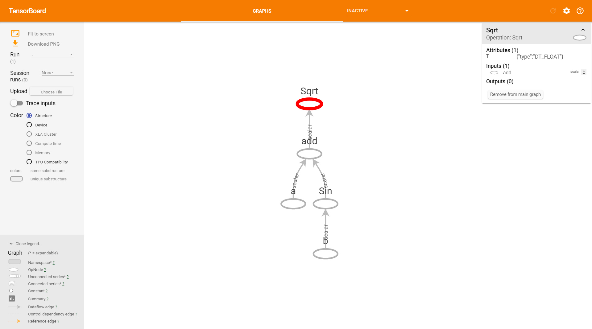
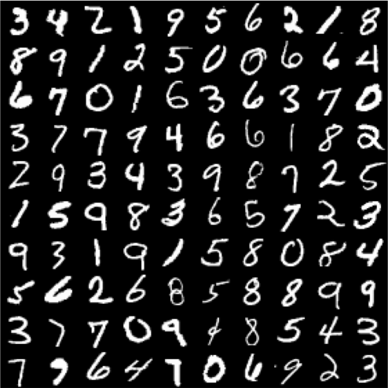

class: middle, center

# TensorFlow and Keras (deep learning by Google) 

[Romain Mormont](http://www.montefiore.ulg.ac.be/~rmormont/)


---
name: with_footer

#  I, Me, Mine

- **Doctorant en machine learning (ML)** à Montefiore sous la supervision de Pierre Geurts et Raphaël Marée  
- **Recherche**: machine learning appliqué au traitement de (très) grandes images médicales

---

# Machine learning ?

Le **machine learning** (supervisé) est un ensemble de méthodes permettant à un système informatique de construire/d'apprendre un modèle entrée(s)-sortie(s) sur base d'un ensemble de données. 

Un **modèle** peut être vu comme une relation entre une ensemble d'entrées (i.e. les variables) et une sortie. Il possède des **paramètres** que l'on peut modifier afin l'adapter à un problème cible. Par exemple:

.grid[
	.col-1-1[]
	.col-2-1[]
]

---

# Deep learning ?

Le **deep learning** est un ensemble de méthodes de machine learning basée sur l'apprentissage de **hierarchies de descripteurs** (<i>hierarchical features</i>). 

Un **descripteur** (<i>feature</i>) est une information extraite d'une entité dans le but de la décrire.

Par exemple, en <i>vision par ordinateur</i>: 

.center[pixel > bord > texton > motif > morceau > objet]

.center[TODO illustration]

???

---
# Deep learning ?

Autres exemples:

- <i>reconnaissance vocale</i>: échantillon > bande spectrale > formant > motif > phonème > mot
- <i>traitement du langage naturel</i>: caractère > mot > groupe nominal/verbal > clause > phrase > histoire

<h2 style="text-align: center; padding-top: 40px; font-size: 115%;">
	Les méthodes de <em>deep learning</em> exploitent ces hierarchies à l'aide de réseaux neuronaux en couche pour obtenir des modèles performants.
</h2>

.center[TODO illustration]

---
# Deep **learning** ?

Travailler avec un modèle sur une tâche cible implique en général deux grandes étapes:

- **entraînement** (<i>training, learning</i>): on optimise les paramètres du modèle afin d'améliorer ses performances. Procédure classique: 
	1. on fournit au modèle un sous-ensemble aléatoire des données d'entraînement (<i>batch</i>) pour lesquels on connait l'objectif et il retourne une prédiction 
	2. on indique au modèle à quel point il s'est trompé avec une **fonction de perte/d'erreur** (<i>loss function</i>)
	3. sur base de l'erreur, les paramètres du modèle sont ajustés pour améliorer ses performances (algorithme de **backpropagation**)
	4. on répète les étapes 1 à 3 jusqu'à ce que le modèle soit suffisamment performant
- **inférence** (<i>prediction, inference</i>): utilisation du modèle afin de produire une prédiction sur des nouvelles données

---
# Deep learning et neural networks ?

Les réseaux neuronaux sont inspirés du fonctionnement du cerveau humain. 

---
# Deep learning frameworks 

Beaucoup de frameworks disponibles: 

- **TensorFlow** (by Google)
- **Keras** (intégré dans TensorFlow depuis 01/2017)
- **Torch/PyTorch** (by Facebook)
- **Caffe2** (by Facebook)
- **CNTK** (by Microsoft)
- **MXNet** (sponsored by the Apache Incubator)
- **DL4j** (by Skymind)
- **Theano** (fin du support annoncée le 28/09/2017)
- ...

Ne pas s'enfermer dans un framework en particulier ! 

---
# TensorFlow

D'après Google: "**<i>An open-source software library for Machine Intelligence</i>** "

Quelques dates:

- 09/11/15: [open-source release](https://research.googleblog.com/2015/11/tensorflow-googles-latest-machine_9.html)
- 03/01/17: [choix de Keras](https://research.googleblog.com/2015/11/tensorflow-googles-latest-machine_9.html) comme interface haut-niveau
- 15/02/17: [version 1.0.0](https://github.com/tensorflow/tensorflow/releases/tag/v1.0.0)
- 06/11/17: [dernière release stable (1.4.0)](https://github.com/tensorflow/tensorflow/releases/tag/v1.4.0)

Quelques chiffres (sur GitHub):

- 1134 contributeurs
- 24117 commits, ~250 par semaine
- 76199 followers
- 1162 issues ouverts (7689 fermées)

???
Librairie de calcul numérique avec des outils pour le deep learning.

---
# TensorFlow 

<span style="font-size: 90%"> 
- **Interface de programmation en Python** mais coeur en C++
- **Graphe de calcul statique**: les noeuds sont les *opérations* et les arêtes sont les *tenseurs*
	- Le graphe doit être compilé avant d'être utilisé
	- Optimisations possibles à la compilation
	- <span></span>&nbsp; Ne permet pas d'implémenter des comportements dynamiques
- **Support deep learning**: beaucoup de composants de base disponibles
- **Programmation déclarative**: le graphe de calcul est construit de manière déclarative
	- Un pas vers l'impératif avec **Eager** (pre-alpha)
- **Support (multi) GPU**
- **TensorBoard**: outil de visualisation, monitoring temps réel via une interface web
- ...
</span>

???
- **`Dataset` API**: construction de pipelines complexes d'accès aux données
- **Debugger dédié `tfdbg`** 

Pourquoi "TensorFlow" ?

Un **tenseur** (<i>tensor</i>) est un objet mathématique. Un scalaire est un tenseur d'ordre 0, un vecteur est un tenseur d'ordre 1, une matrice est un tensor d'ordre 2,... 

- Scalaire: 
```
5.23
``` 
- Vecteur : 
```
[5.3 26.7 33.23]
```
- Matrice : 
```
| 5.3  26.7  33.23 |
| 5.3  3.25  22.53 |
| 8.03 27.1  33.00 |
```

---
# TensorFlow
## Graphe de calcul: définition et exécution

Implémentons l'opération suivante en TensorFlow: 

$$ y = \sqrt{a + \sin(b)} $$


```python
from math import pi
import tensorflow as tf

if __name__ == "__main__":
    # graph definition
    a = tf.placeholder(tf.float32, shape=(), name="a")
    b = tf.placeholder(tf.float32, shape=(), name="b")
    radicand = a + tf.sin(b)
    y = tf.sqrt(radicand)

    # execution
    with tf.Session() as sess:
    	feed = {a: 3, b: pi / 2.0}
        res, = sess.run([y], feed_dict=feed)

        print("y: {}".format(res))
```

???
Runs on GPU by default if one is available and if TensorFlow was installed with GPU support

---
# TensorFlow
## Graphe de calcul: visualisation avec TensorBoard



---
# Keras

Keras, d'après son créateur:

> <i>**Keras** is a high-level neural networks API, written in Python and capable of running on top of TensorFlow, CNTK, or Theano.</i>

Philosophie:

- **User-friendliness**: dévelopé de manière à réduire la charge cognitive du développeur (i.e. API cohérente et simple, feedback d'erreor clairs et exploitables, use cases communs implémentables en un nombre réduit d'étapes...)
- **Modularité**: la librairie est structurée comme un ensemble de modules indépendants qui peuvent être combinés pour créer des modèles
- **Extensibilité**: de nouveaux modules peuvent être créés et intégrés de manière simple

---
# TensorFlow vs. PyTorch

PyTorch est dévelopé par Facebook. Philosopie:

- graphe dynamique
- profondément intégré avec Python (*à la numpy*)
- impératif 

---
# TensorFlow vs. Caffe2


---
# Deep learning with TensorFlow
 
Concentrons-nous sur un problème en particulier: la reconnaissance d'image et plus particulièrement la **reconnaissance de chiffres écrits à la main**.

- Chaque image contient un chiffre de 0 à 9
- Image en noir et blanc, taille 28x28 pixels
- **Objectif**: étant donnée l'image, prédire le chiffre qu'elle contient  

.center[]

---
# (Deep) learning with TensorFlow
## Binary perceptron

Commençons par essayer de distinguer deux chiffres avec un modèle simple (et *superficiel*): le **perceptron binaire**.

$$ \hat{y} = \sigma\left( \sum\_{i = 1}^{N} w\_{i} x\_{i} + b\right) $$

.center[]

.center[On optimise **les paramètres** du perceptron (i.e. les poids $w_i$ et le biais $b$) afin que le modèle puisse distinguer les deux chiffres.]

???

- un neurone
- si $\hat{y}$ est positif: premier chiffre
- si $\hat{y}$ est négatif: second chiffre

---
# Deep learning with TensorFlow
## Binary perceptron


---
# Building bricks0
## Multi-class perceptron 

- $$ \hat{y} = \mathbf{W} \mathbf{x} $$

---
# Building bricks
## Single-layer perceptron

- couche 0
$$ \hat{a}\_k = \sigma\left( \sum\_{i = 1}^{N} w\_{i0k} x\_{i} \right) $$

- neurone de sortie
$$ \hat{y} = \sigma\left( \sum\_{i = 1}^{K} \sum\_{j = 1}^{w} w\_{k1} a\_{k} \right) $$

---
# Building bricks: multi-layer perceptron

---
# How to deal with images ?

---
# Building bricks: convolutional layer

---
# TensorBoard

---
# TensorFlow
## Exécution: choix du device

<span style="font-size: 90%"> 
Forcer l'exécution sur CPU
</span>

```python
# ...
if __name__ == "__main__":
	with tf.device('/cpu:0'):
		a = tf.placeholder(tf.float32, shape=(), name="a")
    	b = tf.placeholder(tf.float32, shape=(), name="b")
    	y = tf.sqrt(a + tf.sin(b))
# ...
```

<span style="font-size: 90%"> 
Forcer l'exécution sur un autre GPU que le GPU par défaut (`'/device:GPU:0'`)
</span>

```python
# ...
if __name__ == "__main__":
	with tf.device('/device:GPU:1'):
		a = tf.placeholder(tf.float32, shape=(), name="a")
    	b = tf.placeholder(tf.float32, shape=(), name="b")
    	y = tf.sqrt(a + tf.sin(b))
# ...
```

---
# Interesting resources

- [PyTorch vs TensorFlow — spotting the difference \[EN\]](https://towardsdatascience.com/pytorch-vs-tensorflow-spotting-the-difference-25c75777377b)
- [Quora - What are the pros and cons of PyTorch vs Keras? \[EN\]](https://www.quora.com/What-are-the-pros-and-cons-of-PyTorch-vs-Keras)
- [Video: What is backpropagation and what is it actually doing?](https://www.youtube.com/watch?v=Ilg3gGewQ5U) 