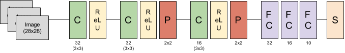

class: middle, center

# *Workshop*: TensorFlow and Keras (deep learning by Google) 

[Romain Mormont](http://www.montefiore.ulg.ac.be/~rmormont/)


---
class: middle, center

# Liens utiles

Slides du talk: https://goo.gl/vqdHSN

Slides du workshop: https://goo.gl/8czTkj

GitHub: https://github.com/waliens/dsl-workshop-tensorflow<br>
<span style="font-size: 0.8em;">(contient les scripts finaux, dossier `code/`)</span>
---
class: center, middle

# Installation

---
# Base de données

On travaille avec MNIST.

Trois sous-ensembles à disposition:

- *train*: pour entraîner les modèles
- *val*: pour évaluer le modèle au cours de l'entraînement
- *test*: pour tester le modèle final

Pour charger le dataset: 

```python
from tensorflow.contrib.learn.python.learn import datasets

mnist = datasets.mnist.read_data_sets("../data", one_hot=True)
x_train = mnist.train.images     # dim: (55000, 784)
y_train = mnist.train.labels     # dim: (55000)
x_val = mnist.validation.images  # dim: (5000, 784)
y_val = mnist.validation.labels  # dim: (5000)
x_test = mnist.test.images       # dim: (10000, 784)
y_test = mnist.test.labels       # dim: (10000)
``` 

---
# Perceptron binaire

$$ \hat{y} = \sigma\left(\mathbf{x}^T\mathbf{w} + b\right) $$

.center[]

- **entrée**: un vecteur $\mathbf{x}$ de 784 éléments
- **poids**: un vecteur $\mathbf{w}$ de 784 éléments
- **biais**: un scalaire $b$
- fonction de perte, <i>binary cross-entropy</i>: 
$$\mathcal{L}(y, \hat{y}) = - y \log \hat{y} - (1 - y) \log (1 - \hat{y}) $$

---
# Perceptron binaire 

Ce dont on a besoin:
- entrées du graphe $\mathbf{X}$ et $y$ $\rightarrow$ `tf.placeholder`
- variables du modèle $\mathbf{w}$ et $b$ $\rightarrow$ `tf.Variable`
- produit matriciel $\rightarrow$ `tf.matmul`
- ajouter le biais $\rightarrow$ `tf.nn.bias_add`
- sigmoïde $\rightarrow$ `tf.nn.sigmoid`
- fonction de perte $\rightarrow$ `tf.log` et `tf.reduce_mean`
- optimisation $\rightarrow$ `tf.train.GradientDescentOptimizer` et `optimizer.minimize`
- initialisation du graphe $\rightarrow$ `tf.global_variables_initializer`

---
# Perceptron binaire 

```python
import tensorflow as tf
from sklearn.metrics import accuracy_score, roc_auc_score
from tensorflow.contrib.learn.python.learn import datasets

def extract_two_digits(digit0, digit1):
	# ... to cut and paste from util.py

def evaluate_binary_model(sess, x, y, x_test, y_test, batch_size=64):
	# ... to cut and paste from util.py

def build_model(n_inputs=784, batch_size=None):
	# ...

if __name__ == "__main__":
	# hyper-parameters
    batch_size = 128
    epochs = 10
    iter_per_epoch = 86
    learning_rate = 5e-2

    # ...

    with tf.Session() as sess:
    	# ...

```

---
# Perceptron multicouche

.center[]

- $L$ est le **nombre de couches**. La couche 0 est le vecteur d'entrée $\mathbf{x}$ 
- $n_l$ est le **nombre de neurones** à la couche $l \in [0, L]$
- $\mathbf{W}\_l$ est la **matrice des poids** de la couche $l \in [1, L]$, (dim. $n\_{l-1} \times n\_l$) 
- $\mathbf{b}\_l$ est le **vecteur de biais** pour la couche $l \in [1, L]$ (dim. $n\_l$)

---
# Perceptron multicouche

.center[]

- *couche d'entrée* (<i>input layer</i>, $l = 0$, $n\_l = 784$): $ $ $\mathbf{a}\_0  = \mathbf{x}$
- *couche cachée* (<i>hidden layer</i>, $l \in [1, L-1]$): 
$$ \mathbf{a}\_l  = \sigma\left(\mathbf{a}\_{l-1}^T \mathbf{W}\_l + \mathbf{b}\_l \right) $$
- *couche de sortie* (<i>output layer</i>, $l = L$, $n\_l = 10$): 
$$\mathbf{\hat{y}}  = \text{softmax}\left(\mathbf{a}\_{L-1}^T \mathbf{W}\_L + \mathbf{b}\_L \right)$$

---
# Perceptron multicouche > TF

```python
import tensorflow as tf
from sklearn.metrics import accuracy_score, roc_auc_score
from tensorflow.contrib.learn.python.learn import datasets


def evaluate_model(sess, x, y, x_test, y_test, 
				   batch_size=64, other_feed=None):
	# ... to cut and paste from util.py


def cross_entropy(y_true, y_pred):
	# ...


def layer(input_layer, input_size, output_size, 
		  activation="sigmoid", name=""):
	# ...


def build_model(n_inputs=784, batch_size=None):
	# ...


```

---
# Perceptron multicouche > TF

```python
if __name__ == "__main__":
    # hyper-parameters
    batch_size = 128
    epochs = 200
    iter_per_epoch = 400
    learning_rate = 5e-2
    hidden_layers = [64, 32, 16]
    n_classes = 10

    # ...

    with tf.Session() as sess:
    	# ...
```

---
# Perceptron multicouche > Keras

```python
import numpy as np
from keras import Input
from keras.engine import Model
from keras.layers import Dense
from keras.optimizers import sgd
from sklearn.metrics import accuracy_score
from tensorflow.contrib.learn.python.learn import datasets


def build_model(hidden_layers, n_classes, n_inputs=784):
	# ...


if __name__ == "__main__":
    # hyper-parameters
    batch_size = 128
    epochs = 200
    learning_rate = 5e-2
    hidden_layers = [64, 32, 16]
    n_classes = 10

    # ...
```

---
# Perceptron multicouche > Keras
## Dropout

Le **dropout** est une méthode de *régularisation*.

.center[]

???
Image source: https://cdn-images-1.medium.com/max/1044/1*iWQzxhVlvadk6VAJjsgXgg.png

---
# Perceptron multicouche > Keras
## Dropout

*Exercice*: ajouter du dropout dans les couches cachées du perceptron multicouche

Pistes:

- en TensorFlow: `tf.nn.dropout`
- en Keras: `keras.layers.Dropout`


---
# Réseaux convolutifs > Keras 

Construisons notre propre réseau convolutif:



- *Couche 1*: 32 filtres 3x3, ReLU, pas de pooling
- *Couche 2*: 32 filtres 3x3, ReLU, max pooling 2x2 avec stride 2x2
- *Couche 3*: 16 filtres 3x3, ReLU, max pooling 2x2 avec stride 2x2 
- *Couche 4*: fully connected layer, 32 neurones, ReLU
- *Couche 5*: fully connected layer, 16 neurones, ReLU
- *Couche 6*: fully connected layer, 10 neurones, Softmax

**Note**: il faut transformer les images d'entrées en matrices!

---
# Réseaux convolutifs > Keras 

```python
import numpy as np
from tensorflow.contrib.learn.python.learn import datasets

def build_model(height, width, n_classes):
	# ...

if __name__ == "__main__":
    epochs = 25
    batch_size = 430
    height, width = 28, 28
    n_classes = 10

	# get data - reshaped
    mnist = datasets.mnist.read_data_sets("../data", one_hot=True)
    x_train = np.reshape(mnist.train.images, (-1, height, width, 1))
    y_train = mnist.train.labels
    
    # ...
```


---
# Réseaux convolutifs > Keras 
## Dropout

**Exercice**: ajouter du dropout dans la partie perceptron multicouche

---
# Réseaux convolutifs > Keras 
## Batch normalization

La **batch normalization** est une méthode de *conditionnement* du réseau. Elle va permettre au réseau de converger plus rapidement.

La batch normalization s'applique à l'entrée d'un bloc de convolution (avant la convolution elle-même).

**Exercice**: ajouter de la batch normalization dans les couches de convolution

Piste en Keras: `keras.layers.BatchNormalization`